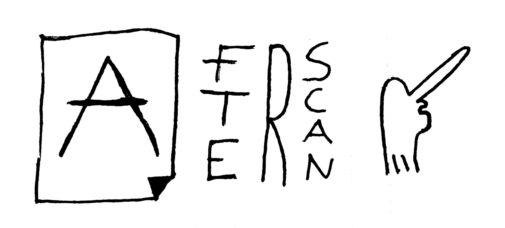
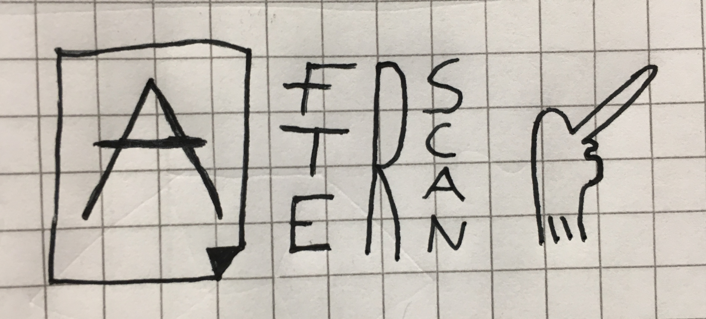

# Afterscan



----

Usage

```
afterscan [OPTIONS] FILENAME
```

Example

```
afterscan myimage.jpg --threshold 75 -f
```

## Options

--threshold INTEGER         Threshold value between 0 and 255. Default=100
-o, --out TEXT              Output path. Default afterscan-[filename] in pwd
-i, --invert / --no-invert  Invert the image
-f, --force / --no-force    Overwrite existing file without asking
--help                      Show this message and exit.

## Demo




